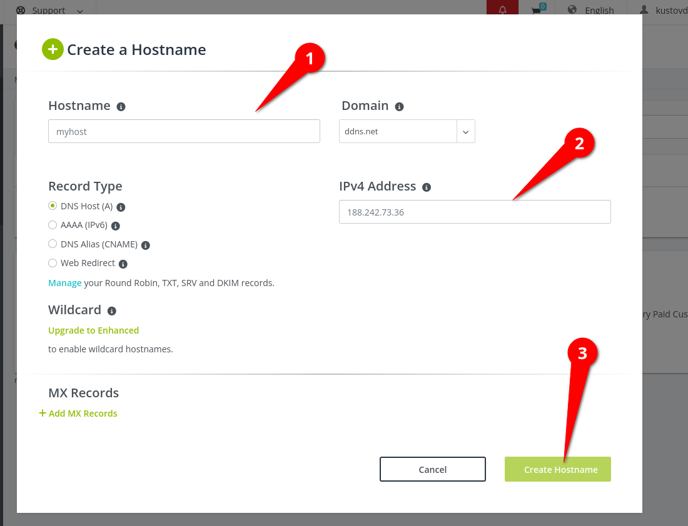

# Как развернуть свой Wireguard VPN сервер с WEB-интерфейсом за одну команду

WireGuard является одним из наиболее популярных и простых в использовании VPN-решений, предоставляющих безопасное сетевое соединение. Если вы ищете быстрый и простой способ развернуть собственный VPN-сервер WireGuard с WEB-интерфейсом, то Docker-контейнер представляет отличное решение. В этой статье мы рассмотрим, как установить и запустить Docker-контейнер WireGuard с WEB-интерфейсом за одну команду, а также как подключиться к нему с различных устройств.

## Сервер

### Развертывание WireGuard WEB UI сервера через Docker

#### Предварительные настройки

Для начала необходимо установить `Ansible`, инструмент автоматизации развертывания приложений на удаленных серверах. Выполните следующую команду для установки Ansible:

```bash
sudo apt install ansible
```

Также чтобы `ansible` подключатся к удаленному серверу через пароль установите:

```bash
sudo apt install sshpass
```

Далее создайте файл `inventory.yml`, в котором нужно указать данные для подключения к серверу, например:

```yml
---
all:
    hosts:
        ИмяСервера1:
            ansible_host: IP_Адрес
            ansible_user: Пользователь
            # SSH порт
            ansible_port: 22
            # Для этого устанавливали sshpass
            ansible_ssh_pass: Пароль
```

Замените `ИмяСервера`, `IP_Адрес`, `Пользователь` и `Пароль` на соответствующие значения для вашего сервера.

#### Вот та единственная команда

Теперь можно выполнить команду для развертывания WireGuard WEB UI сервера с помощью Docker-контейнера:

```bash
ansible-playbook -i ./inventory.yml -l ИмяСервера1 ./wireguard/install_wireguard_server.yml -e PasswordServer=990990
```

Здесь `ИмяСервера` - имя вашего сервера, `PasswordServer` - пароль для WEB-версии WireGuard. После успешного выполнения команды, WEB-версия WireGuard будет доступна по URL: `IP_Адрес:51821`. По умолчанию пароль `990990`

## Клиент

### Телефон

Чтобы подключиться к VPN-серверу WireGuard с вашего телефона, выполните следующие шаги:

1. Установите приложение WireGuard на свой телефон.
2. Отсканируйте QR-код, как показано на скриншоте ниже:

    - 
    - 

3. Нажмите "Добавить" и сохраните настройки VPN.

### Linux

Для подключения к VPN-серверу WireGuard на Linux выполните следующие шаги:

1. Получите файл конфигурации для подключения к VPN-серверу. Выглядит он примерно так:

    

2. Установить WireGuard

    ```bash
    sudo apt install wireguard
    ```

3. Скопируйте файл конфигурации в папку `/etc/wireguard/` с помощью следующей команды:

    ```bash
    cp ИмяКонфигурации.conf /etc/wireguard/
    ```

4. Подключитесь к VPN-серверу WireGuard с помощью следующей команды:

    ```bash
    sudo wg-quick up ИмяКонфигурации
    ```

5. Чтобы отключиться от VPN, выполните следующую команду:

    ```bash
    sudo wg-quick down ИмяКонфигурации
    ```

Теперь у вас есть свой собственный WireGuard VPN сервер с WEB-интерфейсом, развернутый с помощью Docker-контейнера. Вы можете подключиться к нему с различных устройств, включая телефоны и компьютеры с Linux. WireGuard предоставляет безопасное и эффективное шифрованное соединение, которое защищает вашу приватность и обеспечивает безопасность передачи данных в интернете.

# Как развернуть NextCloud на HTTPS всего за одну команду

В современном мире облачные хранилища данных становятся все более популярными. Они предлагают удобный способ хранить, синхронизировать и обмениваться файлами, обеспечивая доступ к ним с любого устройства и из любой точки мира. Однако, многие пользователи предпочитают иметь полный контроль над своими данными и использовать собственные серверы для развёртывания облачных хранилищ. В этой статье мы рассмотрим, как развернуть NextCloud - одно из самых популярных облачных хранилищ с открытым исходным кодом - на HTTPS всего за одну команду.

Мы покажем вам пример команды развёртывания NextCloud на HTTPS, которую можно использовать для создания собственного облачного хранилища данных. Также рассмотрим создание резервной копии файлов NextCloud с помощью RSYNC и создание бесплатного доменного имени для обеспечения доступа к вашему облачному хранилищу из интернета.

Данная статья будет полезна как начинающим пользователям, которые только начинают знакомиться с NextCloud, так и опытным системным администраторам, которые хотят упростить и автоматизировать процесс развёртывания и управления своим облачным хранилищем.

## Подготовка

Создайте на сервере папку по пути `/mnt/extdisk`. Это может быть смонтированный внешний диск

1. Посмотреть список всех дисков

    ```bash
    sudo lsblk # Получить список дисков и их размер
    sudo blkid # Получить UID диска
    ```

2. Создать точку(папку) монтирование для диска

    ```bash
    sudo mkdir /mnt/extdisk
    ```

3. Добавить диск в конфигурационный файл `/etc/fstab`

    ```bash
    sudo nano /etc/fstab
    ```

    ```txt
    UUID=cf0d6629-2bd3-4874-94bf-053e750ae973   /mnt/extdisk   btrfs   defaults   0   2
    ```

    - `cf0d6629-2bd3-4874-94bf-053e750ae973` - Это примерный UUID

4. Теперь можно применить изменения, выполнив команду . Это применит настройки из файла fstab и монтирует ваш внешний диск в указанную точку монтирования.

    ```bash
    sudo mount -a
    ```

    Или это можно сделать вручную

    ```bash
    sudo mount /dev/sdX1 /mnt/extdisk
    ```

    Чтобы от монтировать диск, выполните:

    ```bash
    sudo umount /mnt/extdisk
    ```

## Единая команда для развёртывания NextCloud на HTTPS

Пример команды для развёртывания NextCloud на HTTPS можно найти в репозитории NextCloud Docker на GitHub: [https://github.com/nextcloud/docker/tree/master/.examples/docker-compose/insecure/postgres/fpm](https://github.com/nextcloud/docker/tree/master/.examples/docker-compose/insecure/postgres/fpm).

1. Выполните следующую команду, чтобы передать переменные из командной строки во время запуска `docker-compose`:

```bash
ansible-playbook -i ./inventory.yml -l ИмяСервера1 ./nextcloud/install_nextcloud_server.yml -e POSTGRES_PASSWORD=10101010
```

-   Параметр `POSTGRES_PASSWORD` - пароль для базы данных PostgreSQL.

2. Подождите около 2 минут, чтобы все приложения запустились.
3. Перейдите по URL-адресу `https://Хост`.
4. Создайте учётную запись администратора, указав следующие данные:
    - Пользователь: nextcloud
    - Пароль: nextcloud10101010
5. **Рекомендуется пропустить установку рекомендуемых расширений**.

## Создание резервной копии всех файлов NextCloud с помощью RSYNC

```bash
DISK=$HOME
ansible-playbook -i ./inventory.yml -v -l ИмяСервера1 ./nextcloud/backup_nextcloud_server.yml -e LOCAL_PATH_BACKUP="$DISK/backup_nextcloud"
```

-   Параметр `LOCAL_PATH_BACKUP` - путь на локальной машине, куда будет сохранена резервная копия.

## Создание бесплатного доменного имени

1. Зарегистрируйтесь на `https://my.noip.com/`.
2. Войдите в панель управления `https://my.noip.com/dynamic-dns`.
3. Создайте доменное имя:
    - 
    1. Новое доменное имя.
    2. Адрес сервера.
4. Теперь нужно добавить новое доменное имя в список разрешенных для NextCloud. Для этого подключитесь к серверу с NextCloud и откройте файл `/mnt/extdisk/nextcloud/conf/config.php`. В нём добавьте новое доменное имя. Вот пример:

    ```php
    'trusted_domains' =>
    [
        # Ip сервера
        '95.163.237.199',
        # Доменное имя
        'nextcloud.ddns.net',
    ],
    ```
